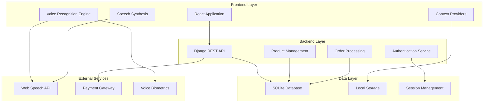
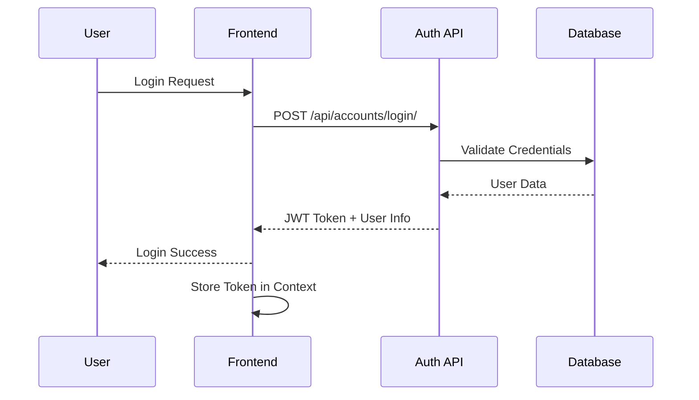
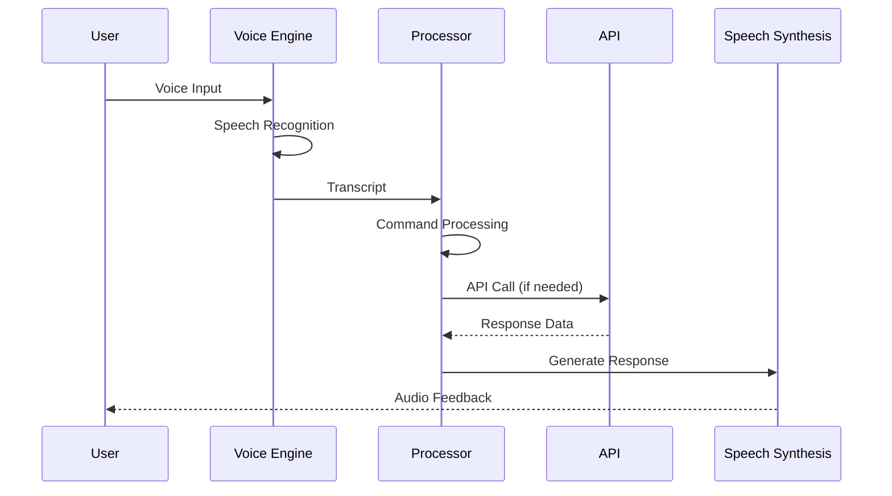
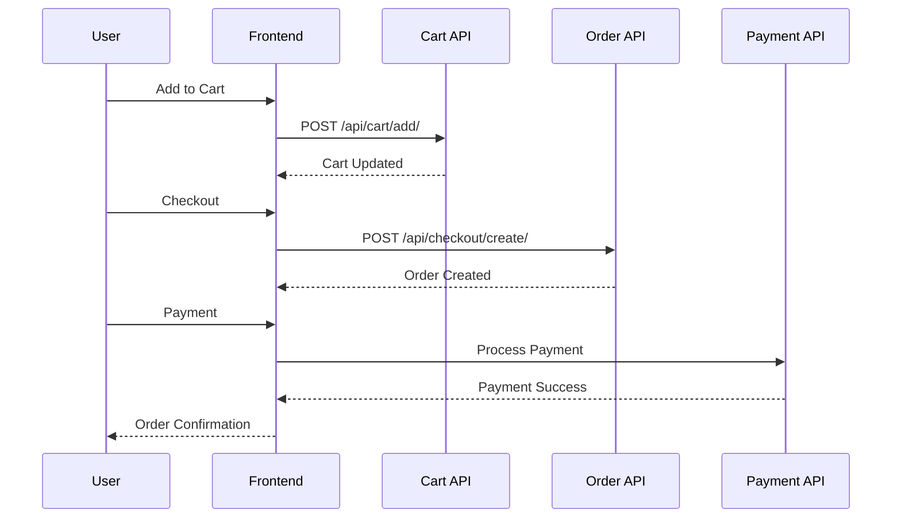

# 🛒 VoiceCart - Voice-First E-Commerce Platform for Seniors

[](https://opensource.org/licenses/MIT)
[](https://www.python.org/downloads/)
[](https://reactjs.org/)
[](https://www.djangoproject.com/)

A comprehensive voice-enabled e-commerce platform specifically designed for senior citizens, featuring intuitive voice navigation, AI-powered recommendations, and accessible user interfaces.

## 📋 Table of Contents

- [🎯 Overview](#-overview)
- [🏗️ Architecture](#️-architecture)
- [🔄 Data Flow](#-data-flow)
- [🚀 Features](#-features)
- [💻 Tech Stack](#-tech-stack)
- [📁 Project Structure](#-project-structure)
- [⚙️ Installation & Setup](#️-installation--setup)
- [📚 API Documentation](#-api-documentation)
- [🧪 Testing](#-testing)
- [🎤 Voice Commands](#-voice-commands)
- [🔒 Security](#-security)
- [📱 Browser Compatibility](#-browser-compatibility)
- [🤝 Contributing](#-contributing)
- [📄 License](#-license)

## 🎯 Overview

VoiceCart is a revolutionary e-commerce platform that prioritizes accessibility and ease of use for senior citizens. By integrating advanced voice recognition technology with a user-friendly interface, it enables seniors to shop online independently and confidently.

### Key Objectives
- **Accessibility First**: Designed with senior-friendly interfaces and voice navigation
- **Independence**: Empowers seniors to shop online without assistance
- **Security**: Implements voice biometric authentication and secure payment processing
- **Simplicity**: Intuitive design with minimal cognitive load
- **Support**: Integrated caregiver access and emergency assistance

## 🏗️ Architecture

### System Architecture Overview



### Component Architecture

```
┌─────────────────────────────────────────────────────────────────┐
│                        VoiceCart Platform                       │
├─────────────────────────────────────────────────────────────────┤
│                     Frontend (React)                           │
│  ┌─────────────────┐  ┌─────────────────┐  ┌─────────────────┐ │
│  │   Voice Layer   │  │   UI Layer      │  │  Context Layer  │ │
│  │                 │  │                 │  │                 │ │
│  │ • Speech Recog  │  │ • React Pages   │  │ • Voice Context │ │
│  │ • Text-to-Speech│  │ • Components    │  │ • Cart Context  │ │
│  │ • Voice Commands│  │ • Responsive UI │  │ • Auth Context  │ │
│  │ • Auto-Narration│  │ • Senior Design │  │ • Caregiver Ctx │ │
│  └─────────────────┘  └─────────────────┘  └─────────────────┘ │
├─────────────────────────────────────────────────────────────────┤
│                    Backend (Django)                            │
│  ┌─────────────────┐  ┌─────────────────┐  ┌─────────────────┐ │
│  │   API Layer     │  │  Business Logic │  │   Data Layer    │ │
│  │                 │  │                 │  │                 │ │
│  │ • REST APIs     │  │ • Product Mgmt  │  │ • SQLite DB     │ │
│  │ • Authentication│  │ • Cart Logic    │  │ • User Models   │ │
│  │ • Voice Auth    │  │ • Recommendations│  │ • Product Data  │ │
│  │ • Admin Panel   │  │ • Caregiver Mgmt│  │ • Order History │ │
│  └─────────────────┘  └─────────────────┘  └─────────────────┘ │
└─────────────────────────────────────────────────────────────────┘
```

## 🔄 Data Flow

### User Authentication Flow



### Voice Command Processing Flow



### E-commerce Transaction Flow



## 🚀 Features

### Core Features
- **🎤 Voice Navigation**: Complete voice-controlled interface
- **🛍️ Product Catalog**: Health, nutrition, and essential products
- **🛒 Smart Cart**: Voice-enabled cart management
- **💳 Secure Checkout**: Multi-step payment with voice authentication
- **📦 Order Tracking**: Complete order history and status tracking
- **❤️ Wishlist**: Voice-controlled wishlist management

### Accessibility Features
- **🔊 Auto-Narration**: Automatic reading of page content
- **🎯 Large UI Elements**: Senior-friendly design with large fonts
- **🌈 High Contrast**: WCAG AA compliant color schemes
- **⌨️ Keyboard Navigation**: Full keyboard accessibility
- **📱 Mobile Responsive**: Optimized for all devices

### Advanced Features
- **🔐 Voice Biometrics**: 5-phrase voice authentication
- **🤖 AI Recommendations**: Personalized product suggestions
- **👨‍⚕️ Health Integration**: Health condition-based filtering
- **👥 Caregiver Access**: Emergency assistance and remote help
- **🌐 Offline Support**: Local storage fallbacks

## 💻 Tech Stack

### Frontend
- **React 18.2+**: Modern React with hooks and context
- **React Router 6**: Client-side routing
- **Web Speech API**: Browser-native speech recognition and synthesis
- **CSS3**: Custom styling with CSS variables
- **Local Storage**: Client-side data persistence

### Backend
- **Django 4.2+**: Python web framework
- **Django REST Framework**: API development
- **SQLite**: Development database
- **Django CORS Headers**: Cross-origin resource sharing
- **Token Authentication**: Secure API authentication

### Voice Technology
- **Web Speech API**: Speech recognition and synthesis
- **Voice Biometrics**: Local voice pattern matching
- **Speech Coordination**: Anti-interruption system
- **Auto-Narration**: Intelligent content reading

## 📁 Project Structure

voicecart/
<<<<<<< HEAD
├── frontend/                          # React Frontend Application
│   ├── public/                        # Static assets
│   ├── src/
│   │   ├── components/                # Reusable UI components
│   │   │   ├── Header.js             # Navigation header
│   │   │   ├── ProductCard.js        # Product display card
│   │   │   ├── VoiceButton.js        # Main voice interface
│   │   │   └── ...
│   │   ├── pages/                     # Page components
│   │   │   ├── HomePage.js           # Landing page
│   │   │   ├── CartPage.js           # Shopping cart
│   │   │   ├── CheckoutPage.js       # Checkout process
│   │   │   ├── PaymentPage.js        # Payment gateway
│   │   │   └── ...
│   │   ├── context/                   # React Context providers
│   │   │   ├── VoiceContext.js       # Voice recognition state
│   │   │   ├── CartContext.js        # Shopping cart state
│   │   │   ├── AuthContext.js        # Authentication state
│   │   │   └── ...
│   │   ├── utils/                     # Utility functions
│   │   └── App.js                     # Main application component
│   ├── package.json                   # Dependencies and scripts
│   └── README.md                      # Frontend documentation
├── backend/                           # Django Backend API
│   ├── voicecart/                     # Main Django project
│   │   ├── settings.py               # Django configuration
│   │   ├── urls.py                   # URL routing
│   │   └── wsgi.py                   # WSGI configuration
│   ├── accounts/                      # User management app
│   │   ├── models.py                 # User, Address, Wishlist models
│   │   ├── views.py                  # Authentication APIs
│   │   ├── serializers.py            # Data serialization
│   │   └── urls.py                   # Account URLs
│   ├── product_assistant/             # Product management app
│   │   ├── models.py                 # Product, Category models
│   │   ├── views.py                  # Product APIs
│   │   └── ...
│   ├── cart/                          # Shopping cart app
│   ├── checkout/                      # Order processing app
│   ├── payments/                      # Payment processing app
│   ├── voice_auth/                    # Voice authentication app
│   ├── manage.py                      # Django management script
│   ├── requirements.txt               # Python dependencies
│   └── README.md                      # Backend documentation
├── docs/                              # Additional documentation
├── .gitignore                         # Git ignore rules
├── LICENSE                            # MIT License
└── README.md                          # This file
```

## ⚙️ Installation & Setup

### Prerequisites
- **Python 3.8+**
- **Node.js 16+**
- **npm or yarn**
- **Git**

### Backend Setup

1. **Clone the repository**
   ```bash
   git clone https://github.com/yourusername/voicecart.git
   cd voicecart
   ```

2. **Set up Python virtual environment**
   ```bash
   cd backend
   python -m venv venv
   
   # Windows
   venv\Scripts\activate
   
   # macOS/Linux
   source venv/bin/activate
   ```

3. **Install Python dependencies**
   ```bash
   pip install -r requirements.txt
   ```

4. **Configure Django settings**
   ```bash
   # Create .env file (optional)
   cp .env.example .env
   
   # Edit .env with your configurations
   ```

5. **Run database migrations**
   ```bash
   python manage.py makemigrations
   python manage.py migrate
   ```

6. **Create superuser**
   ```bash
   python manage.py createsuperuser
   ```

7. **Load sample data**
   ```bash
   python manage.py loaddata sample_data.json
   ```

8. **Start Django server**
   ```bash
   python manage.py runserver
   ```

### Frontend Setup

1. **Navigate to frontend directory**
   ```bash
   cd ../frontend
   ```

2. **Install Node.js dependencies**
   ```bash
   npm install
   # or
   yarn install
   ```

3. **Configure environment variables**
   ```bash
   # Create .env file
   echo "REACT_APP_API_URL=http://localhost:8000" > .env
   ```

4. **Start React development server**
   ```bash
   npm start
   # or
   yarn start
   ```

### Access the Application

- **Frontend**: http://localhost:3000
- **Backend API**: http://localhost:8000
- **Django Admin**: http://localhost:8000/admin

### Default Credentials
- **Admin User**: admin / admin123
- **Test User**: testuser / testpass123

## 📚 API Documentation

### Authentication Endpoints

#### Register User
```http
POST /api/accounts/register/
Content-Type: application/json

{
  "username": "string",
  "email": "string",
  "password": "string",
  "password_confirm": "string",
  "first_name": "string",
  "last_name": "string",
  "phone": "string"
}
```

**Response:**
```json
{
  "user": {
    "id": 1,
    "username": "testuser",
    "email": "test@example.com",
    "first_name": "Test",
    "last_name": "User"
  },
  "token": "abc123...",
  "message": "Registration successful"
}
```

#### Login User
```http
POST /api/accounts/login/
Content-Type: application/json

{
  "username": "string",
  "password": "string"
}
```

#### Get User Profile
```http
GET /api/accounts/profile/
Authorization: Token abc123...
```

### Product Endpoints

#### List Products
```http
GET /api/products/
```

**Query Parameters:**
- `category`: Filter by category name
- `search`: Search in name and description
- `max_price`: Maximum price filter
- `sort`: Sort by (price_low, price_high, rating, name)

**Response:**
```json
{
  "count": 49,
  "next": "http://localhost:8000/api/products/?page=2",
  "previous": null,
  "results": [
    {
      "id": 1,
      "name": "Blood Pressure Monitor",
      "description": "Digital BP monitor with voice guidance",
      "price": "2500.00",
      "category": 1,
      "category_name": "Health & Medical",
      "image_emoji": "🩺",
      "features": ["Large display", "Voice guidance"],
      "in_stock": true,
      "rating": "4.50",
      "review_count": 128
    }
  ]
}
```

#### Get Product Details
```http
GET /api/products/{id}/
```

#### Voice Search
```http
POST /api/products/voice-search/
Content-Type: application/json

{
  "query": "blood pressure monitor"
}
```

### Cart Endpoints

#### Get Cart
```http
GET /api/cart/
Authorization: Token abc123...
```

#### Add to Cart
```http
POST /api/cart/add/
Authorization: Token abc123...
Content-Type: application/json

{
  "product_id": 1,
  "quantity": 2
}
```

#### Update Cart Item
```http
PUT /api/cart/update/{item_id}/
Authorization: Token abc123...
Content-Type: application/json

{
  "quantity": 3
}
```

#### Remove from Cart
```http
DELETE /api/cart/remove/{item_id}/
Authorization: Token abc123...
```

### Order Endpoints

#### Create Order
```http
POST /api/checkout/create/
Authorization: Token abc123...
Content-Type: application/json

{
  "full_name": "John Doe",
  "phone": "9876543210",
  "address": "123 Main St",
  "city": "Mumbai",
  "pincode": "400001",
  "payment_method": "card"
}
```

#### Get User Orders
```http
GET /api/checkout/orders/
Authorization: Token abc123...
```

#### Track Order
```http
GET /api/checkout/track/{order_id}/
Authorization: Token abc123...
```

### Wishlist Endpoints

#### Get Wishlist
```http
GET /api/accounts/wishlist/
Authorization: Token abc123...
```

#### Toggle Wishlist Item
```http
POST /api/accounts/wishlist/toggle/
Authorization: Token abc123...
Content-Type: application/json

{
  "product_id": 1
}
```

### Address Endpoints

#### List Addresses
```http
GET /api/accounts/addresses/
Authorization: Token abc123...
```

#### Create Address
```http
POST /api/accounts/addresses/
Authorization: Token abc123...
Content-Type: application/json

{
  "address_type": "home",
  "full_name": "John Doe",
  "phone": "9876543210",
  "address_line1": "123 Main St",
  "address_line2": "Apt 4B",
  "city": "Mumbai",
  "state": "Maharashtra",
  "pincode": "400001",
  "is_default": true
}
```

## 🧪 Testing

### Test Scenarios

#### 1. User Registration & Authentication
```javascript
// Test Case: Successful Registration
const testData = {
  username: "testuser123",
  email: "test@example.com",
  password: "SecurePass123",
  password_confirm: "SecurePass123",
  first_name: "Test",
  last_name: "User",
  phone: "9876543210"
};

// Expected: 201 Created with user data and token
```

#### 2. Voice Recognition Testing
```javascript
// Test Case: Voice Command Processing
const voiceCommands = [
  "hello",                    // Expected: Voice recognition confirmation
  "go to home",              // Expected: Navigate to home page
  "search for vitamins",     // Expected: Search products
  "add to cart",             // Expected: Add current product to cart
  "show cart",               // Expected: Navigate to cart page
  "checkout now"             // Expected: Navigate to checkout
];
```

#### 3. E-commerce Flow Testing
```javascript
// Test Case: Complete Purchase Flow
const purchaseFlow = [
  "Browse products",         // Navigate to category
  "Select product",          // View product details
  "Add to cart",            // Add item to cart
  "View cart",              // Check cart contents
  "Proceed to checkout",    // Start checkout process
  "Fill delivery details",  // Enter shipping information
  "Select payment method",  // Choose payment option
  "Complete payment",       // Process payment
  "Order confirmation"      // Receive order confirmation
];
```

### Test Data

#### Sample Users
```json
{
  "admin": {
    "username": "admin",
    "password": "admin123",
    "role": "administrator"
  },
  "senior_user": {
    "username": "john_senior",
    "password": "senior123",
    "age": 68,
    "health_conditions": ["diabetes", "hypertension"]
  },
  "caregiver": {
    "username": "mary_caregiver",
    "password": "care123",
    "role": "caregiver",
    "patients": ["john_senior"]
  }
}
```

#### Sample Products
```json
{
  "health_products": [
    {
      "name": "Blood Pressure Monitor",
      "price": 2500.00,
      "category": "Health & Medical",
      "features": ["Voice guidance", "Large display"]
    },
    {
      "name": "Glucose Monitor",
      "price": 1800.00,
      "category": "Health & Medical",
      "features": ["Fast results", "Memory storage"]
    }
  ],
  "nutrition_products": [
    {
      "name": "Vitamin D Tablets",
      "price": 450.00,
      "category": "Nutrition",
      "features": ["1000 IU", "Easy to swallow"]
    }
  ]
}
```

### Running Tests

#### Backend Tests
```bash
cd backend
python manage.py test
```

#### Frontend Tests
```bash
cd frontend
npm test
# or
yarn test
```

#### Voice Recognition Tests
1. Open browser console (F12)
2. Navigate to any page with voice functionality
3. Click the voice button (🎤)
4. Speak test commands
5. Check console logs for recognition results

## 🎤 Voice Commands

### Navigation Commands
- **"go to home"** → Navigate to home page
- **"show cart"** → Open shopping cart
- **"go to health category"** → Browse health products
- **"go to nutrition"** → Browse nutrition products
- **"go to essentials"** → Browse essential items

### Search Commands
- **"search for vitamins"** → Search for vitamin products
- **"find blood pressure monitor"** → Search for BP monitors
- **"show me calcium supplements"** → Search calcium products

### Cart Commands
- **"add to cart"** → Add current product to cart
- **"remove from cart"** → Remove item from cart
- **"checkout now"** → Proceed to checkout
- **"clear cart"** → Empty shopping cart

### Authentication Commands
- **"voice login"** → Start voice authentication
- **"authenticate"** → Begin voice biometric login
- **"logout"** → Sign out of account

### General Commands
- **"hello"** → Test voice recognition
- **"help"** → List available commands
- **"repeat"** → Repeat last announcement
- **"stop"** → Stop current voice operation

## 🔒 Security

### Authentication & Authorization
- **JWT Token Authentication**: Secure API access
- **Voice Biometric Authentication**: 5-phrase voice verification
- **Session Management**: Secure session handling
- **Password Encryption**: Bcrypt password hashing

### Data Protection
- **HTTPS Encryption**: All data transmission encrypted
- **Input Validation**: Server-side input sanitization
- **SQL Injection Prevention**: Parameterized queries
- **XSS Protection**: Content Security Policy headers

### Privacy Features
- **Local Voice Processing**: Voice data stays on device
- **GDPR Compliance**: User data control and deletion
- **Minimal Data Collection**: Only necessary information stored
- **Audit Logging**: Security event tracking

## 📱 Browser Compatibility

### Supported Browsers
- **Chrome 80+** ✅ Full support
- **Edge 80+** ✅ Full support
- **Safari 14+** ✅ Full support
- **Firefox 70+** ⚠️ Limited voice support

### Mobile Support
- **Android Chrome** ✅ Full support
- **iOS Safari** ✅ Full support
- **Mobile Edge** ✅ Full support

### Voice API Support
- **Web Speech API**: Required for voice features
- **Speech Recognition**: Chrome, Edge, Safari
- **Speech Synthesis**: All modern browsers

## 🤝 Contributing

### Development Workflow
1. Fork the repository
2. Create a feature branch (`git checkout -b feature/amazing-feature`)
3. Commit your changes (`git commit -m 'Add amazing feature'`)
4. Push to the branch (`git push origin feature/amazing-feature`)
5. Open a Pull Request

### Code Standards
- **Python**: Follow PEP 8 guidelines
- **JavaScript**: Use ESLint configuration
- **CSS**: Follow BEM methodology
- **Documentation**: Update README for new features

### Testing Requirements
- Write unit tests for new features
- Ensure voice commands work correctly
- Test accessibility compliance
- Verify mobile responsiveness

## 📄 License

This project is licensed under the MIT License - see the [LICENSE](LICENSE) file for details.

---

## 🎉 Acknowledgments

- **Web Speech API** for browser-native voice recognition
- **Django REST Framework** for robust API development
- **React** for modern frontend development
- **Senior citizens** who inspired this accessible design

## 📞 Support

For support, email support@voicecart.com or create an issue on GitHub.

---

**Made with ❤️ for senior accessibility and independence**
=======
├── frontend/ # React frontend
├── backend/ # Django backend
├── docs/ # Documentation (optional)
├── LICENSE
└── README.md


---

## ⚙️ Installation

### Backend Setup

```bash
cd backend
python -m venv venv

# Activate virtual environment
# Windows
venv\Scripts\activate

# macOS / Linux
source venv/bin/activate

pip install -r requirements.txt
python manage.py migrate
python manage.py runserver

Backend runs at:
👉 http://localhost:8000

Admin panel:
👉 http://localhost:8000/admin

Frontend Setup

cd frontend
npm install
npm start

Frontend runs at:
👉 http://localhost:3000

🎤 Example Voice Commands

“go to home”

“search for vitamins”

“add to cart”

“show cart”

“checkout now”
>>>>>>> a4e6dca05c58dc4b689b74967672b1a5b7586bbf
